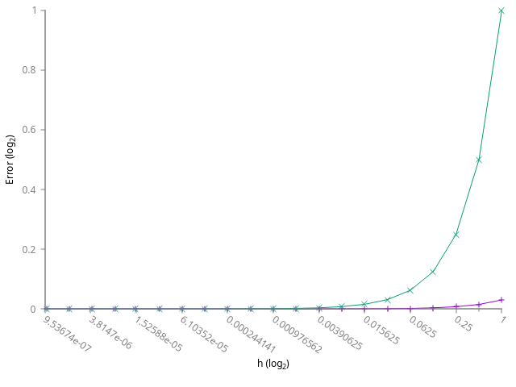

<a href="https://ammonhepworth.github.io/MATH4610/index">HOME</a>



# Definition of Derivative

**Routine Name:** deriveDef

**Author:** Ammon Hepworth

**Language:** C++ compiled with g++


## Description

Computes the derivative using the definition. The definition is { $$\lim_{h\rightarrow0} \frac{f(x+h)-f(x)}{h}$$ }

When computing the derivative of a polynomial, or any other function that reaches large values we can see the importance between absolute and relative error. Absolute error can be very large and vary dramatically, whilst relative error is much more comparable to other functions. In the error graphs, the absolute error is the line above in all of our cases.

An example of the derivative of sin(x) at x=1 when h is approaching 0 is shown below. Also included is the relative and absolute values on a log scale.


Another example below is of the derivative of x^2+3x at x=15 when h is approaching 0 is shown below. Also included is the relative and absolute values on a log scale and a unmodified y scale and log x to show the difference between absolute and relative.




## Input

Takes x, h, and the function desired as a lambda. Inputs x and h are typed by a template.

## Output

Outputs the approximate derivative of the function at the point x and desired h.

## Example


#include <iostream>
#include <fstream>
#include "../error/error.h"
#include "derivativeDefinition.cpp"

int main()
{
  double dx;
  std::ofstream polygraph("polyGraph.txt");
  polygraph << "# h f(x) ABS REL" << std::endl;
  for(double i=1;i>1e-10;i/=2)
  {
      dx = deriveDef<double>(15,i,[](double x){ return x*x+3*x; });
      polygraph << std::showpoint << std::fixed << i << " " << dx << " " << relativeError(33.0, dx) << " " << absoluteError(33.0, dx) << " "  << std::endl;
  }
}


## Result
```
# h f(x) ABS REL
1.000000 34.000000 0.030303 1.000000 
0.500000 33.500000 0.015152 0.500000 
0.250000 33.250000 0.007576 0.250000 
0.125000 33.125000 0.003788 0.125000 
0.062500 33.062500 0.001894 0.062500 
0.031250 33.031250 0.000947 0.031250 
0.015625 33.015625 0.000473 0.015625 
0.007812 33.007812 0.000237 0.007812 
0.003906 33.003906 0.000118 0.003906 
0.001953 33.001953 0.000059 0.001953 
0.000977 33.000977 0.000030 0.000977 
0.000488 33.000488 0.000015 0.000488 
0.000244 33.000244 0.000007 0.000244 
0.000122 33.000122 0.000004 0.000122 
0.000061 33.000061 0.000002 0.000061 
0.000031 33.000031 0.000001 0.000031 
0.000015 33.000015 0.000000 0.000015 
0.000008 33.000008 0.000000 0.000008 
0.000004 33.000004 0.000000 0.000004 
0.000002 33.000002 0.000000 0.000002 
0.000001 33.000001 0.000000 0.000001 
0.000000 33.000000 0.000000 0.000000 
0.000000 33.000000 0.000000 0.000000 
```

## Code


#include <functional>

template <typename T, typename F>
T deriveDef(T x, T h, F f)
{
  return (f(x+h) - f(x))/h;
}


Last Modified: September 2018
