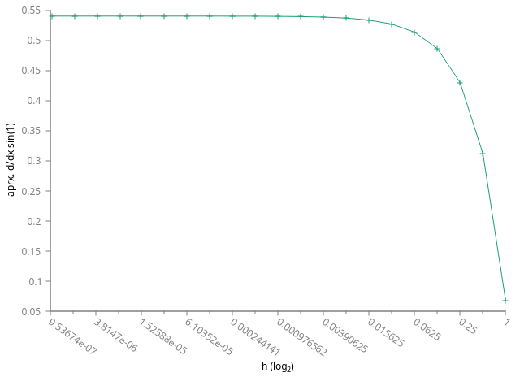
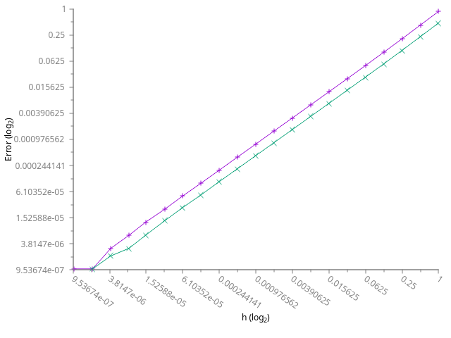
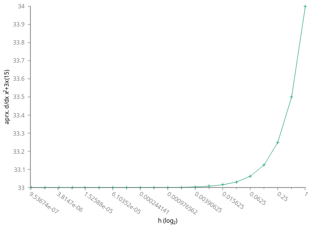
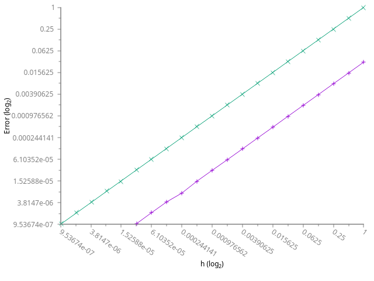

<a href="https://ammonhepworth.github.io/MATH4610/index">HOME</a>



# Definition of Derivative

**Routine Name:** deriveDef

**Author:** Ammon Hepworth

**Language:** C++ compiled with g++


## Description

Computes the derivative using the definition. The definition is \{ $$lim_{h\rightarrow0} {f(x+h)-f(x)}{h}$$ \}.

When computing the derivative of a polynomial, or any other function that reaches large values we can see the importance between absolute and relative error. Absolute error can be very large and vary dramatically, whilst relative error is much more comparable to other functions.

An example of the derivative of sin(x) at x=1 when h is approaching 0 is shown below. Also included is the relative and absolute values on a log scale.



Another example below is of the derivative of x^2+3x at x=15 when h is approaching 0 is shown below. Also included is the relative and absolute values on a log scale.



## Input

Takes x, h, and the function desired as a lambda. Inputs x and h are typed by a template.

## Output

Outputs the approximate derivative of the function at the point x and desired h.

## Example


#include <iostream>
#include <fstream>
#include "../error/error.h"
#include "derivativeDefinition.cpp"

int main()
{
  double dx;
  double sindx;
  std::ofstream polygraph("polyGraph.txt");
  std::ofstream singraph("sinGraph.txt");
  polygraph << "# h f(x) ABS REL" << std::endl;
  singraph  << "# h f(x) ABS REL" << std::endl;
  for(double i=1;i>1e-10;i/=2)
  {
      dx = deriveDef<double>(15,i,[](double x){ return x*x+3*x; });
      polygraph << std::showpoint << std::fixed << i << " " << dx << " " << relativeError(33.0, dx) << " " << absoluteError(33.0, dx) << " "  << std::endl;

      sindx = deriveDef<double>(1,i,[](double x){ return std::sin(x); });
      singraph << std::showpoint << std::fixed << i << " " << sindx << " " << relativeError(0.54030230586, sindx) << " " << absoluteError(0.54030230586,sindx) << " " << std::endl;
  }
}


## Result
```
\# h f(x) ABS REL
1.000000 0.067826 0.874466 0.472476 
0.500000 0.312048 0.422457 0.228254 
0.250000 0.430055 0.204048 0.110248 
0.125000 0.486373 0.099813 0.053929 
0.062500 0.513663 0.049304 0.026639 
0.031250 0.527067 0.024495 0.013235 
0.015625 0.533706 0.012208 0.006596 
0.007812 0.537010 0.006094 0.003292 
0.003906 0.538657 0.003044 0.001645 
0.001953 0.539480 0.001522 0.000822 
0.000977 0.539891 0.000761 0.000411 
0.000488 0.540097 0.000380 0.000205 
0.000244 0.540200 0.000190 0.000103 
0.000122 0.540251 0.000095 0.000051 
0.000061 0.540277 0.000048 0.000026 
0.000031 0.540289 0.000024 0.000013 
0.000015 0.540296 0.000012 0.000006 
0.000008 0.540299 0.000006 0.000003 
0.000004 0.540301 0.000003 0.000002 
0.000002 0.540302 0.000001 0.000001 
0.000001 0.540302 0.000001 0.000000 
0.000000 0.540302 0.000000 0.000000 
0.000000 0.540302 0.000000 0.000000 
0.000000 0.540302 0.000000 0.000000 
0.000000 0.540302 0.000000 0.000000 
0.000000 0.540302 0.000000 0.000000 
0.000000 0.540302 0.000000 0.000000 
0.000000 0.540302 0.000000 0.000000 
0.000000 0.540302 0.000000 0.000000 
0.000000 0.540302 0.000000 0.000000 
0.000000 0.540302 0.000000 0.000000 
0.000000 0.540302 0.000000 0.000000 
0.000000 0.540302 0.000000 0.000000 
0.000000 0.540302 0.000000 0.000000 
```

## Code


#include <functional>

template <typename T, typename F>
T deriveDef(T x, T h, F f)
{
  return (f(x+h) - f(x))/h;
}


Last Modified: September 2018
