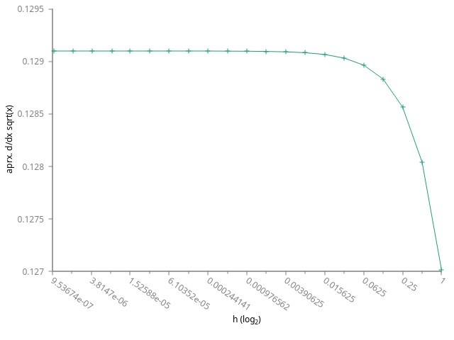
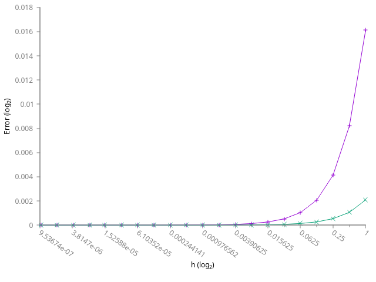
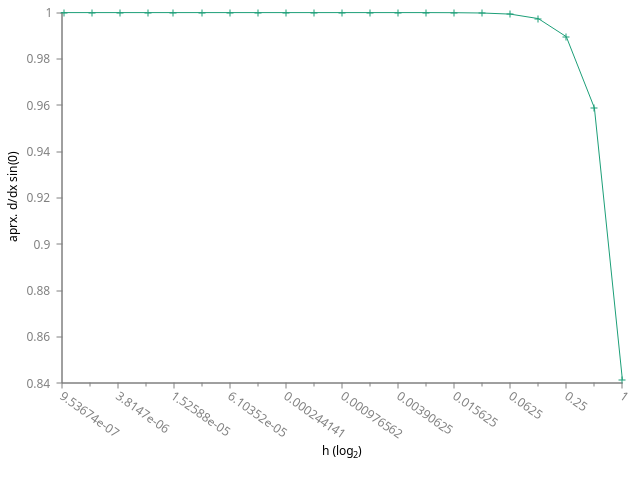
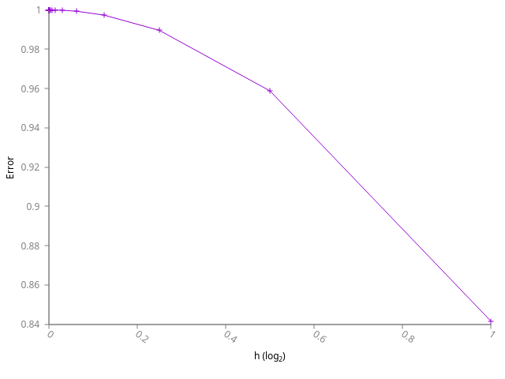

<a href="https://ammonhepworth.github.io/MATH4610/index">HOME</a>



# Part a: manipulation of the approximation

$$ \frac{\sqrt{x+h}-\sqrt{x}}{h} = \frac{\sqrt{x+h}-\sqrt{x}}{h} * \frac{\sqrt{x+h}+\sqrt{x}}{\sqrt{x+h}+\sqrt{x}}$$

$$= \frac{x+h-x}{h*(\sqrt{x+h}+\sqrt{x})} = \frac{h}{h*(\sqrt{x+h}+\sqrt{x})} = \frac{1}{\sqrt{x+h}+\sqrt{x}} $$

We can see below that both methods are just about equal, at least at this specific point.

Unmodified derivative definition:

Modified derivative definition:

# Part b:Taylor Series

The taylor series version evaluated correctly. The performance difference was too slight to notice, most likely because any factorial that would have a large impact is too large to fit in a double. Below is the graph of the plot and of the absolute error, respectively.

Last Modified: September 2018
